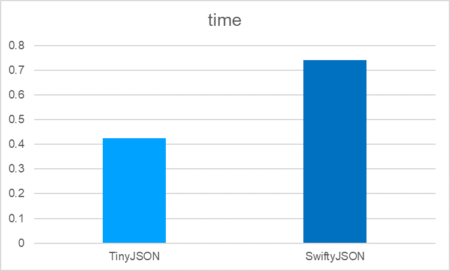

# 性能测试
用例1: [GithubUser](https://blog.ibireme.com/2015/10/23/ios_model_framework_benchmark/) （1.4kB）
测试Data转JSON
每次测试执行 10000 次，统计耗时（单位s）、内存占用（单位kB）。



用例2: [WeiboStatus](https://blog.ibireme.com/2015/10/23/ios_model_framework_benchmark/) （21kB）
测试Data转JSON
每次测试执行 10000 次，统计耗时（单位s）、内存占用（单位kB）。


# 测试结果

- 使用GithubUser
  
   - TinyJSON：
     - 耗时（s）：
        ```
        measured [Time, seconds] average: 0.426, relative standard deviation: 1.635%, values: [0.437652, 0.424977, 0.424683, 0.422759, 0.432851, 0.437840, 0.417436, 0.422799, 0.418913, 0.422024]
        ```
      - 内存占用（kB）：
        ```
        measured [Memory Physical, kB] average: 2.458, relative standard deviation: 133.333%, values: [0.000000, 4.096000, 0.000000, 0.000000, 8.192000]
        ```

  - SwiftJSON：
     - 耗时（s）：
        ```
        measured [Time, seconds] average: 0.741, relative standard deviation: 74.002%, values: [2.386452, 0.580790, 0.563155, 0.554784, 0.556290, 0.550774, 0.553965, 0.552830, 0.555036, 0.557676]
        ```
      - 内存占用（kB）：
        ```
        measured [Memory Physical, kB] average: 7.373, relative standard deviation: 88.889%, values: [12.288000, 0.000000, 16.384000, 8.192000, 0.000000]
        ```

- 使用WeiboStatus
  
   - TinyJSON：
     - 耗时（s）：
        ```
        measured [Time, seconds] average: 7.072, relative standard deviation: 1.802%, values: [6.957767, 6.840306, 7.070187, 7.290702, 7.079223, 7.196287, 6.954814, 7.206447, 7.075492, 7.048047]
        ```
      - 内存占用（kB）：
        ```
        measured [Memory Physical, kB] average: 3.277, relative standard deviation: 145.774%, values: [0.000000, 12.288000, 4.096000, 0.000000, 0.000000]
        ```

  - SwiftJSON：
     - 耗时（s）：
        ```
        measured [Time, seconds] average: 8.551, relative standard deviation: 7.358%, values: [10.331981, 8.173523, 8.206309, 8.190601, 8.299951, 8.402190, 8.834488, 8.630255, 8.165920, 8.276494]
        ```
      - 内存占用（kB）：
        ```
        measured [Memory Physical, kB] average: 86.016, relative standard deviation: 109.586%, values: [266.240000, 94.208000, 20.480000, 20.480000, 28.672000]
        ```

- TinyJSON 在对普通（1.4kB）和较复杂（21kB）json进行装包操作时，对比SwiftyJSON，速度更快、占用内存更小。

# 参考资料
- https://github.com/vdka/JSON
- https://blog.ibireme.com/2015/10/23/ios_model_framework_benchmark/
